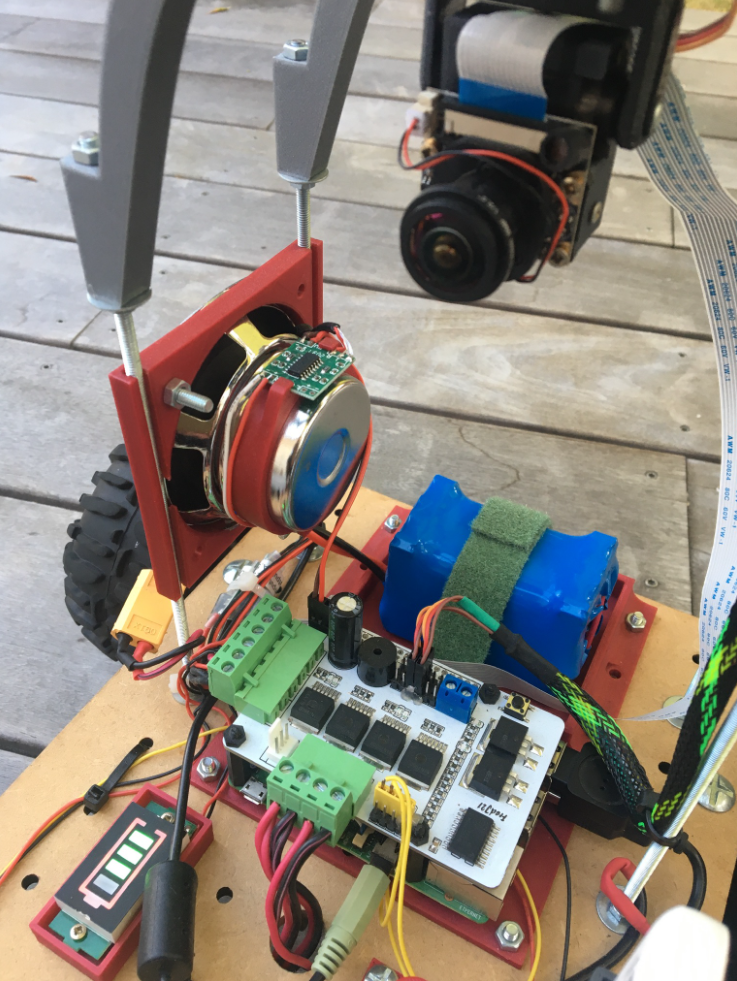
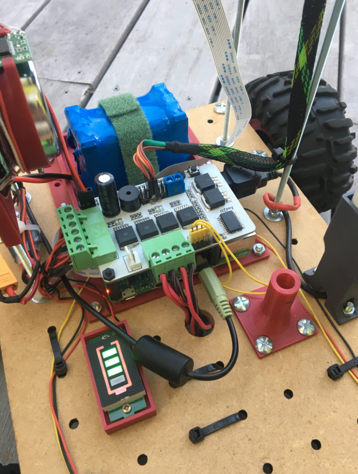
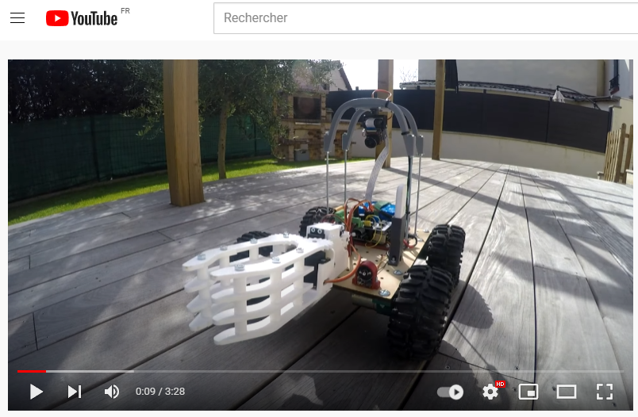

# Raspberry PI - Motor Driver Hat

### Compatibilité avec Vigibot.com

La carte "MotorDriverHat" à été conçue pour fonctionner très simplement sur Vigibot.com, avec une configuration quasi par défaut.

## [https://www.vigibot.com](https://www.vigibot.com])

Documentations : https://www.robot-maker.com/forum/226-documentation-vigibot-francaise/

---
### Pinout Vigibot.com
Voici la configuration par défaut des raccordement Vigibot.com

```
                                      ------------------
                                     |  Vigibot Pinout  |
                                      ------------------

                                       3V3  (1) (2)  5V
                       I2C SDA       GPIO2  (3) (4)  5V
                       I2C SCL       GPIO3  (5) (6)  GND
                                     GPIO4  (7) (8)  GPIO14
                                       GND  (9) (10) GPIO15
    Right infrared illuminator      GPIO17 (11) (12) GPIO18        Buzzer
                  Right wheels      GPIO27 (13) (14) GND
                      Switch 6      GPIO22 (15) (16) GPIO23        Switch 7
                                       3V3 (17) (18) GPIO24        Left wheels
     Max brightness & contrast      GPIO10 (19) (20) GND
                                     GPIO9 (21) (22) GPIO25        Left wheels
                                    GPIO11 (23) (24) GPIO8         Gripper tilt
                                       GND (25) (26) GPIO7         Gripper claw
                                     GPIO0 (27) (28) GPIO1
                    Turret pan       GPIO5 (29) (30) GND
                   Turret tilt       GPIO6 (31) (32) GPIO12        Left arm
                     Right arm      GPIO13 (33) (34) GND
                                    GPIO19 (35) (36) GPIO16        Left infrared illuminator
                  Right wheels      GPIO26 (37) (38) GPIO20        Switch 4
                                       GND (39) (40) GPIO21        Switch 5
```
---
## Configuration

La carte "MotorDriverHat" est au plus proche de la configuration par défaut Vigibot.com.

Mais l'utilisation de 4 Gpio nécessite de modifier les "Outputs" 4 et 5 dans la configuration matérielle afin de spécifier le mode PwmPwm et d’indiquer les sorties utilisées :

```
{
  "OUTPUTS": [
    {
      "NAME": "Left wheels",
      "TYPE": "PwmPwm",
      "ADRESSE": -1,
      "GPIOS": [ 24, 25],
      "SLEEPMODES": [ "Floating", "Floating" ],
      "INS": [ -100, -1, 1, 100 ],
      "OUTS": [ -100, -1, 1, 100 ],
    },
    {
      "NAME": "Right wheels",
      "TYPE": "PwmPwm",
      "ADRESSE": -1,
      "GPIOS": [ 26, 27],
      "SLEEPMODES": [ "Floating", "Floating" ],
      "INS": [ -100, -1, 1, 100 ],
      "OUTS": [ -100, -1, 1, 100 ],
}
```

Pour plus de détails sur cette configuration et pour ajuster en fonction de vos besoin n'hésitez pas à jeter un oeil sur [comment configurer vigibot pour mes moteurs et autres actionneurs](https://www.robot-maker.com/forum/topic/13285-comment-configurer-mon-robot-vigibot-pour-piloter-moteurs-relais-et-leds/).

---

## Exemples d'utilisation
| <a href="../photos/vigibot_1.png"></a>|<a href="../photos/vigibot_2.png"></a>|
|-----|-----|

***Sur robot-maker.com*** --> https://www.robot-maker.com/forum/topic/13417-explorerfredj21-un-robot-4-roues-motrices-tres-simple-sur-vigibotcom/

## En Vidéos
<a href="https://youtu.be/hQlef5lsTA4"></a>
https://youtu.be/hQlef5lsTA4
